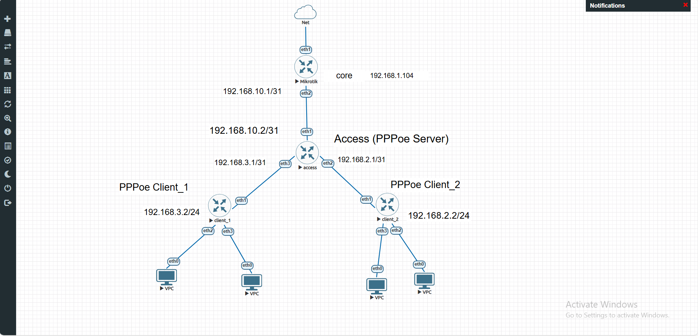
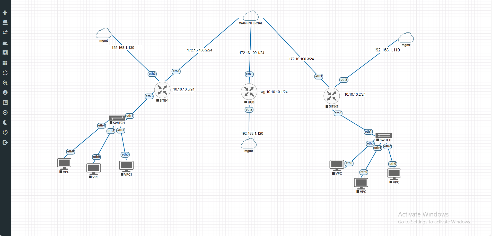
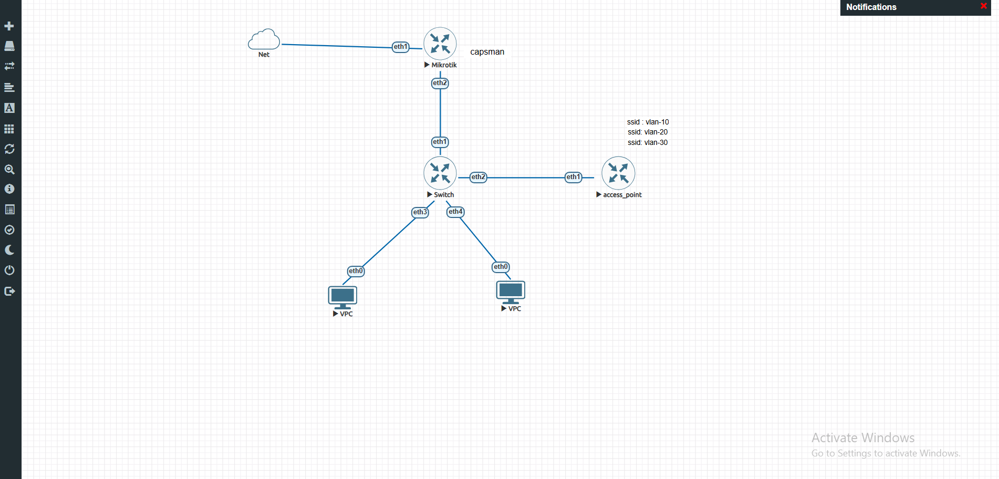

MikroTiks_Labs_official

🚀 MikroTik Ansible Labs

Overview

Infrastructure Automation with Ansible & RouterOS API.

This repository contains a collection of real‑world MikroTik network labs automated using Ansible. The goal is to demonstrate clean architecture, idempotent automation, and enterprise‑style network design.


---

📌 Key Features

✅ Modular Ansible architecture (Roles / Playbooks / Inventories)

✅ Per‑lab isolated inventories

✅ RouterOS API automation (no CLI scraping)

✅ Idempotent execution (changed = 0 on re‑run)

✅ Realistic enterprise network scenarios

✅ Ready for EVE‑NG / GNS3 / physical MikroTik devices


---

⚙️ Requirements

Ansible ≥ 2.14

Python ≥ 3.9

MikroTik RouterOS ≥ 7.x

RouterOS API enabled


Install required collections
```bash
ansible-galaxy collection install -r requirements.yml
```

---

🧪 Available Labs


---

🟢 PPPoE ISP Lab



Description

Simulates an ISP environment using MikroTik routers:

Core router acting as ISP

Multiple PPPoE servers and clients

Profiles, secrets, pools, and authentication

Fully automated via RouterOS API


Run the Lab
```bash
ansible-playbook playbooks/pppoe/pppoe.yml -i inventories/pppoe/hosts.yml
```

---

🔵 OSPF Routing Lab


Description

Enterprise‑grade OSPF deployment:

Loopback interfaces for Router‑ID

OSPF instance, areas, and interface‑templates

Passive and point‑to‑point interfaces

Idempotent configuration (no duplicates)


Run the Lab
```bash
ansible-playbook playbooks/ospf/ospf.yml -i inventories/ospf/hosts.yml
```

---

🟣 WireGuard VPN Lab



Description

Secure site‑to‑site VPN using WireGuard:

Encrypted tunnels

Peer automation via RouterOS API

Ready for dynamic routing integration

Clean and minimal configuration


Run the Lab
```bash
ansible-playbook playbooks/wireguard/wireguard.yml -i inventories/wireguard/hosts.yml
```

---

🟠 VLAN + CAPsMAN Wireless Lab



Description

Enterprise wireless architecture:

Router as Gateway + CAPsMAN Controller

MikroTik switch with Bridge VLAN Filtering

Multiple VLANs (MGMT / GUEST / SALES)

VLAN‑based SSIDs

DHCP per VLAN

Zero‑touch CAP provisioning


Run the Lab
```bash
ansible-playbook playbooks/vlan-capsman/dhcp-vlan-capsman.yml -i inventories/dhcp-vlan-capsman/hosts.yml
```

---

🔴 Load Balancing Lab


Description

Multi‑ISP load‑balancing scenario:

Multiple WAN links

Policy routing

NAT per ISP

Scalable and extendable design


Run the Lab
```bash
ansible-playbook playbooks/loadbalancing/loadbalancing.yml -i inventories/loadbalancing/hosts.yml
```

---

🔐 Connection Method

All devices are managed using RouterOS API only:

ansible_connection=network_cli
ansible_network_os=community.routeros.routeros

> No SSH CLI scraping is used.


---

♻️ Idempotency Guarantee

First run → changed > 0

Second run → changed = 0


Achieved using:

API queries before object creation

Conditional logic in tasks

Proper object matching and filtering


---

🧠 Learning Objectives

This project helps you learn:

Network automation best practices

MikroTik RouterOS internals

Scalable Ansible architecture

Real ISP & enterprise network designs

Infrastructure as Code (IaC)


---

📌 Future Labs (Planned)

BGP (iBGP / eBGP)

MPLS + LDP

RADIUS + WPA2‑Enterprise

Captive Portal (Hotspot)

QoS per user / per VLAN


---

🤝 Contributions

Contributions, suggestions, and improvements are welcome. Feel free to open an issue or submit a pull request.


---

📜 License

MIT License
