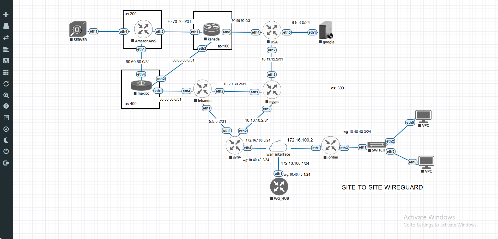
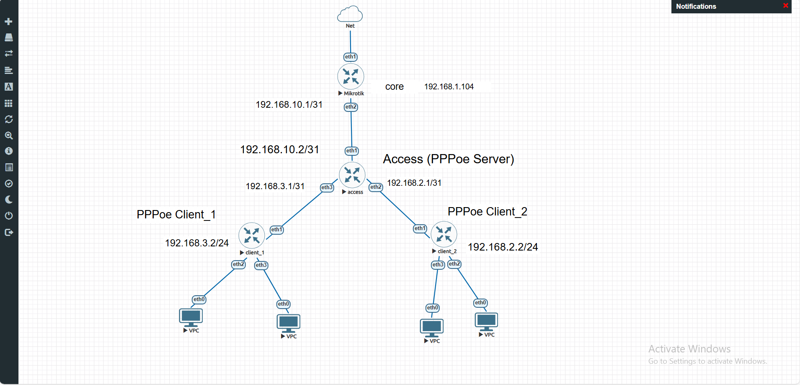
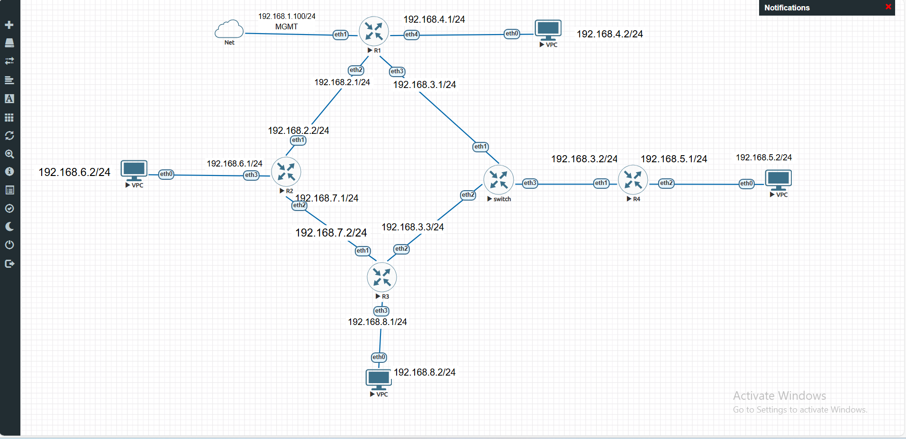
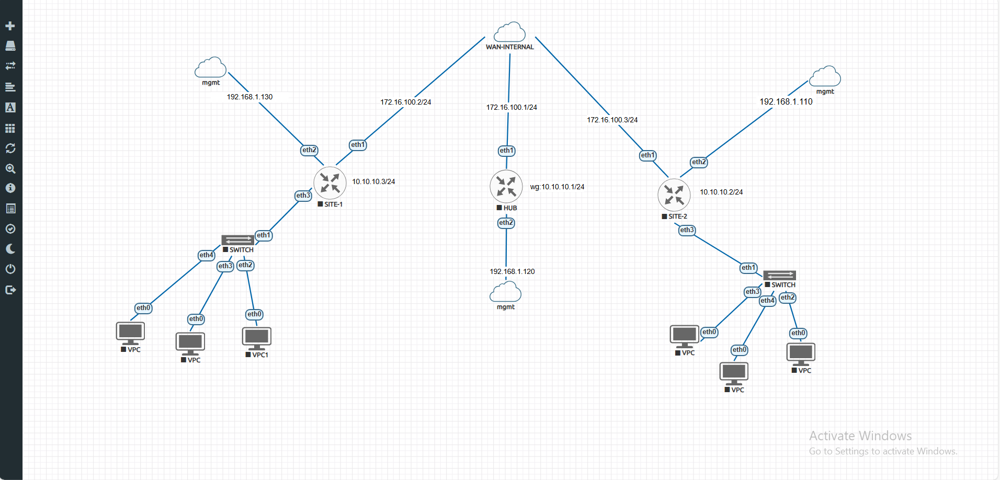
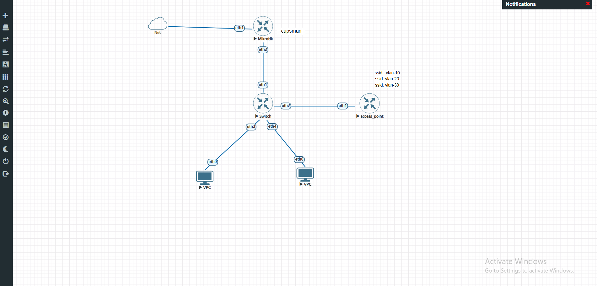

# 🚀 MikroTik Ansible Labs

> **Infrastructure Automation with Ansible & RouterOS API**

[](https://ansible.com)
[](https://mikrotik.com)
[](https://python.org)
[](LICENSE)

---

This repository contains a collection of real‑world MikroTik network labs automated using Ansible. The goal is to demonstrate clean architecture, idempotent automation, and enterprise‑style network design.


---

📌 Key Features

✅ Modular Ansible architecture (Roles / Playbooks / Inventories)
✅ Per‑lab isolated inventories
✅ RouterOS API automation (no CLI scraping)
✅ Idempotent execution (changed = 0 on re‑run)
✅ Realistic enterprise network scenarios
✅ Ready for EVE‑NG / GNS3 / physical MikroTik devices


---

⚙️ Requirements

Ansible ≥ 2.14

Python ≥ 3.9

MikroTik RouterOS ≥ 7.x

RouterOS API enabled


Install required collections
```bash
ansible-galaxy collection install -r requirements.yml
```

---

🧪 Available Labs


---

🟠  MIKROTIK_FULL_LAB



MIKROTIK_FULL_LAB is a complete real-world enterprise & ISP simulation that combines multiple advanced technologies into a single cohesive architecture.
This lab represents how MikroTik networks are actually deployed in production environments.
Included Technologies
 OSPF
Ready for real hardware
Run 
```bash
ansible-playbook \
  -i MIKROTIK_FULL_LAB/inventories/realWorld/hosts.yml \
  MIKROTIK_FULL_LAB/playbooks/realWorld/site.yml
```

---


🟢 PPPoE ISP Lab



Run the Lab
```bash
ansible-playbook playbooks/pppoe/pppoe.yml -i inventories/pppoe/hosts.yml
```

---

🔵 OSPF Routing Lab




Run the Lab
```bash
ansible-playbook playbooks/ospf/ospf.yml -i inventories/ospf/hosts.yml
```

---

🟣 WireGuard VPN Lab



Run the Lab
```bash
ansible-playbook playbooks/wireguard/wireguard.yml -i inventories/wireguard/hosts.yml
```

---

🟠 VLAN + CAPsMAN Wireless Lab




Run the Lab
```bash
ansible-playbook playbooks/capsman/capsman.yml -i inventories/capsman/hosts.yml
```

---

--
---


📌 Future Labs (Planned)

MPLS + LDP

RADIUS + WPA2‑Enterprise

Captive Portal (Hotspot)

QoS per user / per VLAN


---

🤝 Contributions

Contributions, suggestions, and improvements are welcome. Feel free to open an issue or submit a pull request.


---

📜 License

MIT License
